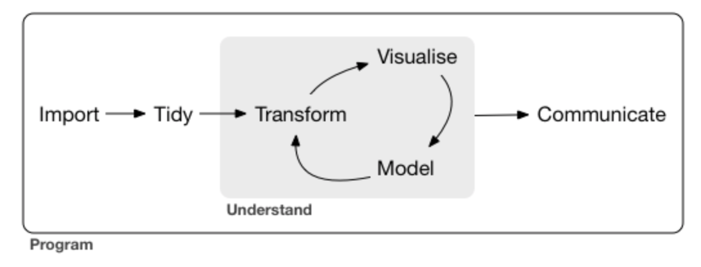

## Basic process



## Setup environment

```{r}
library(gapminder)
library(dplyr)
```

## Verbs

- Filter - extract subset
- Arrange - sort on a variable
- Mutate - transform or add column

```{r}

# Filter gapminder by year and country
gapminder %>% 
  filter(year == 2002,
    country == "China")

# Filter year and sort by descending population
gapminder %>% 
  filter(year == 1957) %>%
    arrange(desc(pop))

# Use mutate to create a new column called lifeExpMonths
gapminder %>% mutate(lifeExpMonths = lifeExp * 12)
```

# Plot 

Log scale is a change times 10 times the difference to better distinguish differences.

```{r}
library(ggplot2)

gapminder_1952 <- gapminder %>% filter(year == 1952)

# Scatter plot comparing pop and gdpPerCap, with both axes on a log scale
ggplot(gapminder_1952, aes(x = pop, y = lifeExp, 
  color = continent,
  size = gdpPercap)) +
  geom_point() +
  scale_x_log10() + 
  scale_y_log10() +
  facet_wrap(~ continent)


```

Add a new chunk by clicking the *Insert Chunk* button on the toolbar or by pressing *Cmd+Option+I*.

When you save the notebook, an HTML file containing the code and output will be saved alongside it (click the *Preview* button or press *Cmd+Shift+K* to preview the HTML file). 

The preview shows you a rendered HTML copy of the contents of the editor. Consequently, unlike *Knit*, *Preview* does not run any R code chunks. Instead, the output of the chunk when it was last run in the editor is displayed.

